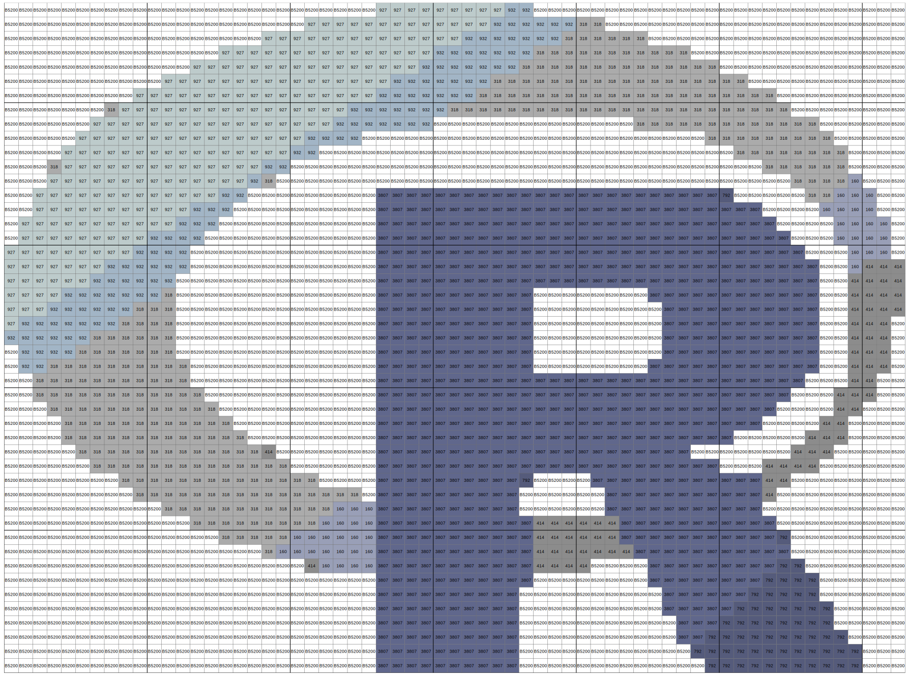
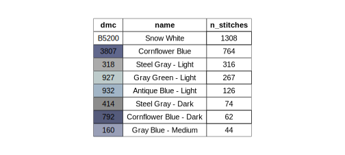

<!-- README.md is generated from README.Rmd. Please edit that file -->

```{r, include = FALSE}
knitr::opts_chunk$set(
  collapse = TRUE,
  comment = "#>",
  fig.path = "man/figures/README-",
  out.width = "100%"
)
```

# embroidr

<!-- badges: start -->
[](https://lifecycle.r-lib.org/articles/stages.html#experimental)
<!-- badges: end -->

{embroidr} is an R package developed to support with the planning of embroidery projects. Its main function currently is to produce a cross-stitch pattern from any image. 

## Installation

You can install the development version of embroidr from [GitHub](https://github.com/BenjaminVigreux/embroidr) with:

``` r
# install.packages("devtools")
devtools::install_github("BenjaminVigreux/embroidr")
```
## Cross-stitch pattern

The main function of this package, create_pattern_from_image(), is a function to help turn an image into a cross-stitch embroidery pattern. 

To use this function, you'll need to find an image you'd like to turn into a cross-stitch pattern. For example, say I'd like to use the following R logo, which I have downloaded and stored as a png file. 


I first turn this image into a raster array.

``` {r}
image_array <- png::readPNG("README-Images/R_logo.png")
```

And then use the create_pattern_from_image() function to turn it into a nice cross-stitch pattern.

``` {r, eval = FALSE}
embroidr::create_pattern_from_image(
  image = image_array,   # use the image_array as input
  size_unit = "cm",      # in this case I want the pattern for an embroidery that is
  img_size = c(10, 7.5), # 10cm wide and 7.5cm high on
  cloth_count = 16,      # 16-count cloth
  n_colours = 10          # and which uses a maximum of 10 colours
)
```

Running this creates and saves 2 (.svg) files, which can then be opened in any browser and printed out:

1. The cross-stitch pattern, with DMC colours specified. (Note: The image below is not full-size; it has been resized to fit the width of this page.)



2. A list of all DMC colours needed to produce the pattern.

```{r, echo=FALSE, out.height=="100%"}

```

For a more complete walkthrough of the different options for create_pattern_from_image(), see my [blog post introducing {embroidr}](https://rdvark.net/2022/05/14/introducing-embroidr/).

You might have noticed that the cross-stitch pattern isn't perfect; which is down to the fact that it is difficult for a computer to recognise and compare colours in the same way that we're able to as human beings. However, {embroidr} provides us with a good starting template and set of colours. It is then up to embroiderer's discretion to make tweaks as they please :)

## Acknowledgments

+ {embroidr} builds on and was heavily inspired by the Mosaics aspect of Ryan Timpe's package [{brickr}](https://github.com/ryantimpe/brickr/). 
+ The DMC floss data that comes with {embroidr} was compiled and cleaned by Sharla Gelfand in their package [{dmc}](https://github.com/sharlagelfand/dmc). 

